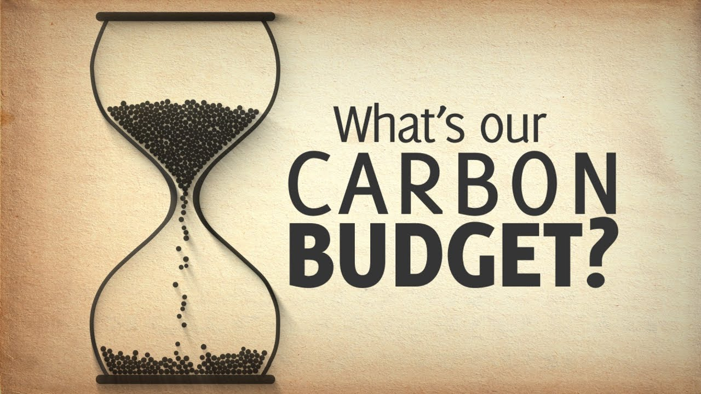

import ImageCard from '../src/components/ImageCard/ImageCard';
import sslogo from '/img/speed-and-scale-logo.jpg';
import ddlogo from '../static/img/project-drawdown-logo.png';

## ⛳️ Start here

## Definition of LEVEL 0

:::info Level 0
**Stay here if you**:

- Know very little about what "[climate tech](#what-is-climate-tech)" means

- Need to brush up on [fundamental climate knowledge](#fundamental-climate-knowledge)

- Want to understand [what a climate job is like](#what-is-a-climate-job-like)

- Have never heard of the Project Drawdown [Solution Framework](#project-drawdown-solution-frameworks) or the [Speed and Scale](#speed-and-scale) Framework

- Are not yet a member and would like to learn more about these 3 [core communities](#core-communities):
	- The Handbook Slack Community
	- Work on Climate
	- MCJ Collective
:::

    <ImageCard
    title="Skip to Level 1"
    description="If you are familiar with the basics, but need to hone in on a climate solution"
    imageUrl="img/level-1-mario.jpg"
    linkUrl="level-1"
    />
    <ImageCard
    title="Skip to Level 2"
    description="If you are actively working on a climate solution and need to advance faster"
    imageUrl="img/level-2-mario.jpg"
    linkUrl="level-2"
    />

## Lesson Start

 

Congratulations! You took the first step.

:::note Lesson 1
### In this lesson:
- What is "climate tech"
- Intro to Climate Solution frameworks
- What a climate job is like
- Intro to core communities and resources
:::

## What is Climate Tech?

There is both a **broad definition**, 

as well as a Silicon Valley style **industry definition**.

:::book a broad definition
Any form of technology that will help us implement our climate goals, particularly the 1.5C goal which requires:

- 50% emission reduction by 2030
- Net zero emissions by 2050.
:::

#### A Silicon Valley style industry definition:

:::book rough industry definition:

A recent financial movement to invest in startups that are focused on a particular solution to the climate emergency.
:::book
#### Climate tech vs Clean tech:

First - **fixing climate is a subset** within a broader circle of clean technologies.

:::note For example
Water pollution, plastic pollution, or e-waste do not cause greenhouse emissions. However, they are still a critical problem affecting environmental health, justice, and the biodiversity crisis.
:::

Second - **The term "clean tech" has a negative association** with a failed "Clean Tech 1.0" startup period from 2006-2011. 

:::note What happened?
MIT Technolgy review called it a bloodbath that "[ended in disaster](https://www.technologyreview.com/2020/11/30/1012660/venture-capital-clean-tech-boom-biden/), wiping out billions in investments and scaring venture capitalists away for years."

_More context from BVP: "[Eight lessons from the first climate tech boom and bust](https://www.bvp.com/atlas/eight-lessons-from-the-first-climate-tech-boom-and-bust)"_
:::

Climate tech can be seen as a "Clean tech Version 2.0" the 2020s.

## What is a climate job like?

:::question Frequently Asked Questions
- [How well does it pay?](#how-well-does-it-pay)

- [How do I learn the necessary skills?](#how-do-i-learn-the-necessary-skills)

- [How secure are these jobs?](#how-secure-are-these-jobs)

- [How much do I need to know about climate science and politics?](#how-much-do-i-need-to-know-about-climate-science-and-politics)

- [How do I avoid greenwashing?](#how-do-i-avoid-greenwashing)

<!--questions about IT tech, deep tech, hard tech, and trade work-->

:::
### How well does it pay?

#### Early stage startups:

You will be dealing with a lot of early stage startups.

Roughly 3,000+ companies / organizations exist in our current database.

:::note Most often
- **Early stage startups tend to pay lower salaries** in exchange for generous equity packages.

- **That said, climate startups want to attract quality talent** and hopefully understand that competitive pay is important.
:::

#### Established companies:

:::note another option
Change the direction of your current company.

Or try to steer a bigger company that's been around for a while.

- --Project Drawdown has a [guide on this topic](park) / [Workforclimate.org](
https://www.workforclimate.org/)

- Companies like Microsoft, Google, Stripe, etc. have a specific corporate 
sustainability positions. There are also many consultancies.

- Think outside the box. For example, you are in procurement, you have a 
huge opportunity to order supplies that come from clean sources. Start a green team that doesn't exist in your current job
:::

#### Don't forget Government Jobs:

:::note Government Jobs
There are plenty of government jobs <!--governmentjobs.com example urls-->

- The salaries are lower, but some states and counties <!--munis??--> offer good health care and pensions

- There can be a higher level of job security, predictability, and transparency compared to a fast moving startup environment.

- Policy and academic roles are valuable as well (for example, analyzing the impact of voluntary carbon markets)
:::

---
:::question
##  How do I learn the necessary skills?
:::

There are two aspects:

1. **Marketable skills**

2. **Domain knowledge**

Marketable Skills:

:::note 3+ years of tech experience
#### If you already have marketable skills and tech experience

There are [plenty of jobs](https://climatetechlist.com) that have the same roles as a non-climate tech company

:::

What if you don't have tech experience?

:::info Experience gap
#### If you are new to tech without 3+ years of experience

[You can contribute](contribute) to the Handbook as an open source project to gain experience quickly
:::

Next is domain knowledge.

:::tip Domain knowledge
#### You're in the right place!

- We built the Handbook to gather the best information on [all 93 Climate Solutions](solutions) from Project Drawdown

- Writing is learning. [Contribute to the Handbook](contribute) and become an expert
:::
---

:::question
###  How secure are these jobs?
:::

- **It varies by job category** - [Startup](early-stage-startups) vs [Established company](#established-companies) vs [Government](#dont-forget-government-jobs)

- **It varies by climate solution** - some solutions are better established and others are very early.

**For example:**

- The highest anticipated growth is in automotive, power generation, and electrical efficiency.  <!--citation. MCJ Podcast??, add links to solution pages-->

- Voluntary Carbon Markets started as a popular solution, but have recently been hit by a round of layoffs, due to public criticism on overstated benefits.

As we [continue writing the Handbook together](contribute), we will better be tracking news on [Solution](solutions) viability in the marketplace.

---

:::question
### How much do I need to know about climate science and politics?
:::

It depends on:

#### 1. The [Solution](solution) space

For example, a solution involving the [electrical](sector-electricity) grid can get quite complicated.

#### 2. The job role

- When it comes to the role, being a software engineer or running people operations are more transferrable. 

- But, you are in sales or marketing, you need to know as much as possible about your industry market.

---

:::question
###  How do I avoid greenwashing?
:::

- Read and support journalism outlets such as [DeSmog](https://www.desmog.com//), [Grist](grist.org), [Inside Climate News](https://insideclimatenews.org/), [Climate Desk](climatedesk.org), [Drilled](https://drilled.media), and more.
<!--Link to Resources, and Media Sector-->
- This is a big topic and we are working on a guide

- [Tell us your findings on Slack](contribute) and we'll report on it

---

## Fundamental Climate Knowledge

:::info If you already know this
Skip to:
- [Solution Frameworks](#solution-frameworks)
- [Core Communities](#core-communities)
- [Skill Requirements](#skill-requirements)
:::
###

#### The 2015 Paris Agreement:

The bottom line is that we are supposed to keep the global average temperature down to **1.5 degrees celsius**.

This would allow us to avoid [the most catastrophic impacts](https://www.npr.org/2021/11/08/1052198840/1-5-degrees-warming-climate-change).

To do so, **we need to cut greenhouse pollution down 50% by 2030 and 100% by 2050.**

By 2050 we need to be at "net zero".

#### 1.5 degrees versus 2 degrees celsius:

Reaching our 2030 goal is not likely.

However, we still have a chance of keeping the global average temperature near 2 degrees celsius within the next 23 years.

<iframe
src="https://ourworldindata.org/grapher/total-ghg-emissions?tab=chart&country=~OWID_WRL" loading="lazy"
width="100%"
height="600px"
></iframe>

#### Our carbon budget:

There are many different calculations.

One [budget from the Mercator Research Institute on Global Commons and Climate Change](https://www.mcc-berlin.net/en/research/co2-budget.html) states:

- The world is emitting roughly 42.2 gigatons of greenhouse pollution per year.

- **We have roughly 995 gigatons left if we want some likelihood of staying below 2C.**

- We have [250 gigatons of CO2 left](https://www.washingtonpost.com/climate-environment/2023/06/08/carbon-budget-study-climate-change/) to stay below 1.5 degrees, roughly 5 years.

The global standard comes from the United Nations [Intergovernmental Panel on Climate Change](https://www.ipcc.ch) (IPCC).

#### Common myths:

[SkepticalScience.com maintains a good list](https://skepticalscience.com/argument.php) counter-arguments to over 200 climate myths.

One of the [most important myths to debunk](https://upgrader.gapminder.org/q/85) is the belief that global temperatures will decline as greenhouse emissions go down.

This implies that we can partially reduce emissions and keep global temperatures at a stable level.

In reality, carbon dioxide persists for [hundreds of years](https://www.epa.gov/ghgemissions/overview-greenhouse-gases#CO2-references)

**We need to cut emissions completely** to stop any further damage.

Partial cuts will not work. 

---

## Solution Frameworks

Time for the good news. We have solutions!

### Project Drawdown

[Project Drawdown](https://drawdown.org) is a non-profit organization that created a list of the 93 top climate solutions.

The list comes from a global coalition of leading scientists.

They calculated and ranked the highest likelihood of reducing greenhouse pollution based on available solutions today.

Examples include:

- Reducing food waste

- Alternatives to meat

- Alternative refrigerants

- Family planning

:::note
The Handbook's [Solution Page](solutions) is mostly based off of Project Drawdown.
:::

### Speed and Scale

[Created by venture capitalist John Doerr](https://speedandscale.com), this framework has both similarities and differences with Drawdown.

Rather than a big list of 93 Solutions ranked by gigaton reduction, the Speed and Scale framework uses Doerr's popular [OKR system](https://en.wikipedia.org/wiki/Objectives_and_key_results) for measuring "objective key results."

:::note OKR Tracker
Here is Speed and Scale's [official OKR Tracker](https://speedandscale.com/tracker/)
:::

:::question
#### Which framework to use?
:::

Both are valuable and are not mutually exlusive.

Project Drawdown has some more granular solutions, while Speed and Scale has larger categories.

Speed and Scale has a great OKR system that is time bound and uses very specific metrics to track progress.

## Core Communities

--more networking tips in Lesson 1

:::info [Help us](contribute) improve this page
:::
