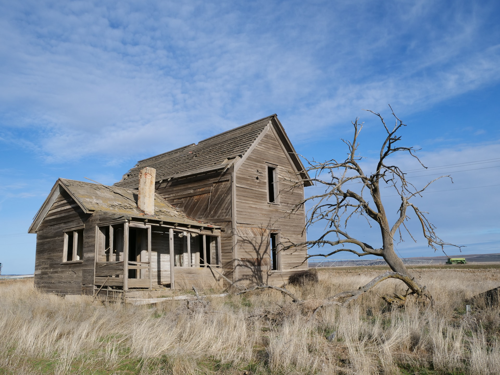

        
List of companies working in this solution...

        

            <ul>
             
                <li><a href="https://nan">Control Desert</a></li>
            
                <li><a href="https://dendra.io">Dendra Systems</a></li>
            
            </ul>
        

        

## Overview

Abandoned farmland restoration is the process of returning abandoned or degraded farmland to a productive state. This can be done through a variety of methods, including reforestation, afforestation, and soil rehabilitation.

## Progress Made

A number of breakthrough technologies have been developed in recent years that have made abandoned farmland restoration more effective and efficient. One example is the use of drones to map and assess degraded landscapes. This data can then be used to plan and implement restoration projects.

Another example is the use of satellite imagery to track changes in land cover over time. This information can be used to identify areas of farmland that are at risk of abandonment and to monitor the progress of restoration projects.

These technologies have helped to reduce greenhouse gas emissions by restoring degraded landscapes and increasing the amount of carbon dioxide that is sequestered in the soil.

## Lessons Learned

The key lessons that have been learned in the development and implementation of Abandoned Farmland Restoration to mitigate the effects of climate change are:

1. The need for long-term planning and commitment: The successful restoration of abandoned farmland requires long-term planning and commitment from all stakeholders involved. This includes government agencies, landowners, NGOs, and the local community.

2. The importance of community involvement: The involvement of the local community is crucial for the success of any abandoned farmland restoration project. Without the support of the community, it is very difficult to achieve the necessary buy-in and commitment from all parties involved.

3. The need for an integrated approach: A successful abandoned farmland restoration project requires an integrated approach that takes into account the social, economic, and environmental factors involved.

4. The importance of monitoring and evaluation: Monitoring and evaluation are essential to ensure that the goals of the restoration project are being met and to make necessary adjustments along the way.

## Challenges Ahead

The major challenges that remain in the development and implementation of Abandoned Farmland Restoration to reverse climate change are:

1. Ensuring that the abandoned farmland is suitable for restoration.

2. Obtaining the necessary funding to carry out the restoration project.

3. Overcoming the social and political barriers to the adoption of this technology.

## Best Path Forward

The best path forward for the continued development and implementation of Abandoned Farmland Restoration to effectively mitigate the effects of climate change is to ensure that the technology is adopted on a large scale and is effective. To do this, steps need to be taken to ensure that the technology is affordable and accessible to farmers, and that it is able to be implemented on a large scale. Additionally, research and development needs to continue in order to improve the effectiveness of the technology.

---

Photo by <a href="https://unsplash.com/@walloftheo?utm_source=unsplash&utm_medium=referral&utm_content=creditCopyText">Theo Bickel</a> on <a href="https://unsplash.com/photos/iFn_scvCN4s?utm_source=unsplash&utm_medium=referral&utm_content=creditCopyText">Unsplash</a>
