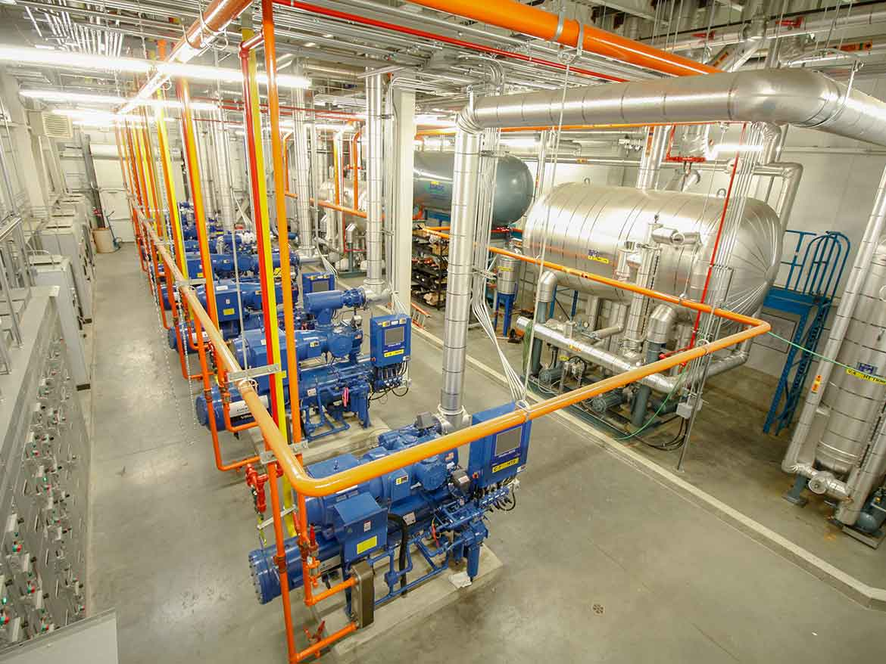

:::info [Help us track this Solution](contribute)
This a sample ChatGPT page to get the ball rolling.

[Click here to contribute content and feedback](contribute)
:::

        
List of companies working in this solution...

        Experimental feature. Exciting Updates Underway!
        

            <ul>
             
                <li><a href="https://DyeCoo.com">Dyecoo</a></li>
            
                <li><a href="https://ccccx.net">C4x Green Carbon</a></li>
            
                <li><a href="https://www.c16bio.com/">C16 Biosciences</a></li>
            
                <li><a href="https://arviatechnology.com">Arvia Technology</a></li>
            
                <li><a href="https://atomocoffee.com">Atomo Molecular Coffee</a></li>
            
                <li><a href="https://www.solugentech.com/">Solugen</a></li>
            
                <li><a href="https://nan">Ecoware</a></li>
            
            </ul>
        

        

:::company
  #### [Jobs listed in this solution at Climatebase](https://climatebase.org/jobs?l=&q=&drawdown_solutions=Alternative+Refrigerants)
:::
## Overview

* **Alternative Refrigerants**: Significant progress in developing environmentally-friendly alternatives such as CO2 and ammonia (NH3).
* **Benefits of CO2 & NH3**: Both are naturally occurring, non-toxic, non-flammable, and ozone-friendly.
* **Industry Leaders**: Daikin Industries (Japanese) and Honeywell International (American) are pioneering in CO2 and NH3-based refrigerant systems.

## Progress Made

* **CO2 Refrigeration**: Low GWP, non-toxic, and non-flammable. Already in use in commercial and industrial sectors.
* **NH3 Refrigeration**: Similar advantages as CO2 and growing in application.
* **Man-made Gases**: HFCs, HCFCs, and FCs, all with high GWP, are being phased out under the Montreal Protocol.

## Lessons Learned

* **Low GWP Preference**: Refrigerants with lower GWP have been more successful.
* **Safety Concerns**: Flammable refrigerants have had safety issues; ammonia has associated health risks; carbon dioxide also has safety concerns.
* **Top Advocates**: United Nations Environment Programme (UNEP), International Institute for Sustainable Development (IISD), World Bank, and International Energy Agency (IEA) lead in advocating and implementing alternative refrigerants.

## Challenges Ahead

* **High Initial Costs**: A significant barrier for many potential adopters.
* **Infrastructure Lacking**: The absence of a robust infrastructure to support alternative refrigerants hinders their adoption.
* **Awareness Issues**: General unawareness among individuals and organizations can limit the uptake of these alternatives.

## Best Path Forward

* **R&D Investments**: Pour more resources into refining and making the technology more cost-efficient.
* **Public Education**: Raise awareness about the benefits of alternative refrigerants.
* **Incentives for Businesses**: Provide benefits to businesses that switch to alternative refrigerants.
* **Industry Giants' Role**: Companies like Honeywell, DuPont, and Chemours should continue their pioneering work, share insights, and drive industry standards.

*Image from [ES Magazine](https://www.esmagazine.com/articles/101759-tracking-the-evolution-of-industrial-refrigerants)*