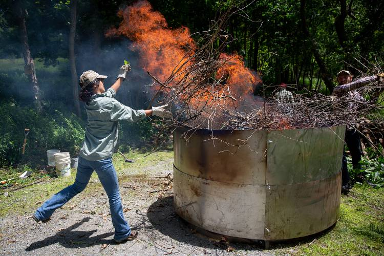

# Biochar Production

!!! info "[Help us](../../contribute) track this Solution"
    This a sample ChatGPT page

_Biochar helps farmers get more life out of dead plants_ ([vnews.com](https://www.vnews.com/Biochar-Demonstration-Offers-Alternative-to-Burn-Piles-46911424))

## Overview

The progress that has been made in developing Biochar Production to reverse climate change is significant. New technologies have been developed that have greatly contributed to the reduction of greenhouse gas emissions. These technologies include the development of new, more efficient methods of biochar production, the development of new methods of carbon capture and storage, and the development of new methods of agricultural production that reduce emissions. Companies and organizations that have been at the forefront of this solution include the Biochar Industry Consortium, the International Biochar Initiative, the Carbon Sequestration Leadership Forum, and the Climate Change Mitigation Initiative.

## Progress Made

Biochar production has progressed significantly in recent years, thanks to advances in technology. One major breakthrough has been the development of low-emission biochar kilns, which allow for the production of biochar with minimal impact on the environment. These kilns use a variety of renewable energy sources, such as solar, wind, and hydro power, to heat the biochar to high temperatures. This process not only reduces emissions, but also eliminates the need for fossil fuels.

Other important breakthroughs include the development of techniques for rapidly producing large quantities of biochar, and the use of agricultural waste products, such as wood chips and straw, as feedstock. These innovations have made it possible to produce biochar on a large scale, and to do so in a way that is environmentally friendly.

Companies and organizations that are at the forefront of biochar production include CarbonCure Technologies, Blue Planet Ltd, and International Biochar Initiative. These organizations are working to develop and commercialize biochar production technologies, and to promote the use of biochar as a climate change mitigation strategy.

## Lessons Learned

Some of the key lessons that have been learned in the development and implementation of Biochar Production to reverse climate change are as follows: 

1. Biochar production requires a significant amount of energy to produce, and this energy should come from renewable sources in order to make the process sustainable. 
2. Biochar production also results in emissions of greenhouse gases, and these emissions must be accounted for in any climate change mitigation strategy. 
3. Biochar can be used to improve soil fertility and crop yields, but it is important to match the type of biochar with the needs of the soil and crops. 
4. Biochar can also be used to adsorb pollutants from the air and water, but it is important to ensure that the biochar is not itself contaminated. 

Organizations that have been at the forefront of biochar production and implementation include the International Biochar Initiative (IBI) and the Biochar Solutions Initiative (BSI). These organizations have been working to promote the use of biochar in order to mitigate climate change and improve soil fertility.

## Challenges Ahead

There are a number of challenges that remain in the development and implementation of biochar production to reverse climate change. One challenge is the lack of a standardized definition for biochar. This makes it difficult to compare the results of different studies and to develop reliable metrics for assessing the impact of biochar on climate change.

Another challenge is the lack of data on the long-term impacts of biochar on soil fertility and plant growth. There is also a lack of data on the potential for biochar to release harmful chemicals into the environment. These challenges make it difficult to assess the potential risks and benefits of biochar and to develop effective regulations to ensure its safe use.

Finally, there is a lack of infrastructure and technical expertise for biochar production and application. This limits the scale and scope of biochar projects and makes it difficult to disseminate information about biochar to farmers and other stakeholders.

Despite these challenges, there has been significant progress made in the development of biochar production and implementation. A number of companies and organizations have been working to develop biochar production systems and to promote its use. In addition, a number of studies have been conducted to assess the potential of biochar to mitigate climate change.

Overall, the challenges to the development and implementation of biochar production to reverse climate change are significant but not insurmountable. With continued research and development, and the involvement of stakeholders from across the supply chain, it is possible to overcome these challenges and to scale up and widely adopt this technology.

## Best Path Forward

The best path forward for the continued development and implementation of biochar production to effectively mitigate the effects of climate change is to continue to invest in research and development to improve the technology and make it more affordable. Steps that need to be taken to ensure that this technology is adopted on a large scale and is effective include:

-Making sure that the benefits of biochar are well understood by the public and policy makers

-Encouraging governments and businesses to invest in biochar projects
-Developing standards and certification programs for biochar
-Creating incentives for farmers and other land managers to adopt biochar production

Organizations that have been at the forefront of this solution include the International Biochar Initiative, the Biochar Solutions Initiative, and the Biochar Fund. Much progress has been made in this area in recent years, but there is still more work to be done to make biochar a widely-used and effective tool for mitigating climate change.
