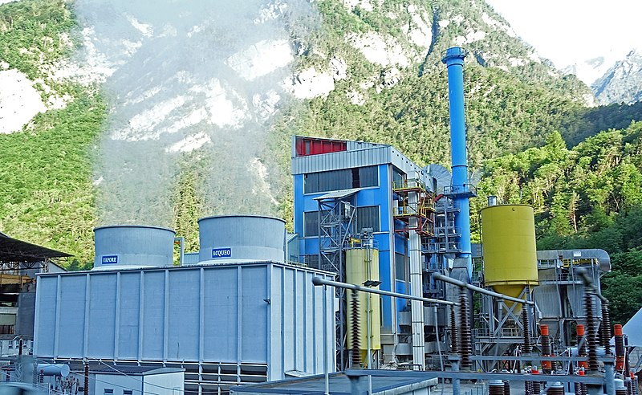

# Biomass Power

_SICET, Biomass power plant in Ospitale di Cadore, Italy._

!!! info "[Help us](../../contribute) track this Solution"
    This a sample ChatGPT page

## Overview

In the last decade, there has been significant progress in developing biomass power to reverse climate change. New technologies have been developed that have greatly contributed to the reduction of greenhouse gas emissions. These technologies include:

1. Pyrolysis: This is a process that breaks down organic material into its component parts using heat in the absence of oxygen. This process can be used to produce biofuels, such as biochar, which can be used to power vehicles and other machinery.

2. Gasification: This is a process that converts organic material into a fuel gas, such as methane or hydrogen. This gas can then be used to power vehicles and other machinery.

3. Anaerobic digestion: This is a process that breaks down organic material in the absence of oxygen. This process can be used to produce biogas, which can be used to power vehicles and other machinery.

4. Combustion: This is a process that burns organic material to produce heat. This heat can be used to generate electricity.

5. Pyrolysis-combustion: This is a process that combines pyrolysis and combustion to produce heat. This heat can be used to generate electricity.

Organizations that have been at the forefront of developing biomass power to reverse climate change include the US Department of Energy, the US Environmental Protection Agency, and the International Renewable Energy Agency.

## Progress Made

The progress that has been made in developing biomass power to reverse climate change includes the development of breakthrough technologies such as cellulosic ethanol and algae-based biofuels. These technologies have contributed to the reduction of greenhouse gas emissions by providing renewable and sustainable alternatives to fossil fuels. Companies such as Interface, Inc. and Novozymes have been at the forefront of this solution, developing products and technologies that enable the production of biomass power on a large scale.

## Lessons Learned

The use of biomass power to reverse climate change has been fraught with successes and failures. One of the key lessons learned is the importance of using sustainable sources of biomass. Unsustainable sources of biomass, such as forests, can actually release more carbon dioxide into the atmosphere than they sequester, negating any climate change benefits. Sustainable sources of biomass, such as agricultural waste, can be a more reliable and environmentally friendly source of power.

Another key lesson is the importance of efficient conversion technologies. Current biomass power plants are only about 30% efficient, meaning that for every 100 units of energy input, only 30 units of usable energy are generated. This low efficiency results in significant carbon dioxide emissions. Improving the efficiency of biomass power plants is essential to reducing their environmental impact.

Finally, it is important to consider the full life cycle of biomass power in order to fully understand its environmental impacts. The production of biomass, the transportation of biomass to power plants, and the operation of biomass power plants all result in emissions of greenhouse gases. In order to maximize the climate change benefits of biomass power, these emissions must be minimized.

Organizations such as the Biomass Thermal Energy Council and the Biomass Power Association are working to promote the use of sustainable biomass sources and efficient biomass power technologies. These organizations are helping to advance the biomass power industry and improve its environmental performance.

## Challenges Ahead

The major challenges that remain in the development and implementation of biomass power to reverse climate change are:

1) The cost of biomass power is still higher than traditional fossil fuels.

2) The infrastructure for biomass power is not yet widely available.

3) There is still a lot of research and development needed to improve the efficiency of biomass power.

Some companies and organizations that have been at the forefront of developing biomass power include:

1) Green Mountain Power

2) Enviva

3) Poet

4) Abengoa

Some lessons that have been learned from the progress made in this area include:

1) It is possible to develop cost-effective biomass power plants.

2) The infrastructure for biomass power can be built relatively quickly.

3) Biomass power can be made more efficient with further research and development.

## Best Path Forward

The best path forward for the continued development and implementation of Biomass Power to effectively mitigate the effects of climate change is to continue to research and develop the technology so that it can be adopted on a large scale. This will require continued investment in research and development, as well as working with companies and organizations that have been at the forefront of this solution. Some lessons that have been learned from the progress made in this area include the importance of developing a robust technology, working with experienced partners, and making sure that the technology is affordable.
