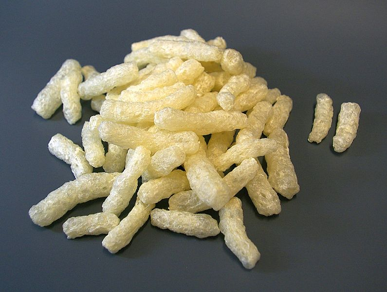

_Packing peanuts made from bioplastics (thermoplastic starch) ([Wikipedia](https://commons.wikimedia.org/wiki/File:St%C3%A4rke-Packstoff_P%C3%B6mpel_CG.jpg))_

:::info [Help us track this Solution](contribute)
This a sample ChatGPT page to get the ball rolling.

[Click here to contribute content and feedback](contribute)
:::

:::info Companies working in this solution 
- [Agua Inc](https://aguainc.com)
- [Full Cycle Bioplastics](http://fullcyclebioplastics.com/)
- [Visolis](http://www.visolisbio.com/)

Checkout the [jobs listed in this solution at Climatebase](https://climatebase.org/jobs?l=&q=&drawdown_solutions=Bioplastics)
:::

## Overview

- **Bioplastics** are made from renewable sources (corn, sugar cane) and replace fossil fuel-based plastics.
- Bioplastics are **recyclable**, **compostable**, and help curb landfill emissions.
- Companies leading bioplastics development: NatureWorks, BASF, Dow Chemical.
- Organizations like **Biodegradable Products Institute** promote bioplastics and certify compostable products.

## Lessons Learned

- **Bioplastics** are promising but require proper **development** and **implementation**.

- Bioplastics' slower degradation requires **proper disposal**.
- Leading entities: **Neste**, **BASF**, **Novamont**.
- More work needed to optimize bioplastics' effectiveness.

## Challenges Ahead

- **Rapid and complete degradation** needed; some bioplastics degrade slowly or incompletely.
- **Cost-competitiveness** with traditional plastics remains a challenge.

## Companies/Organizations Leading:

-  **BASF**: A major chemical company pioneering various bioplastics.
- **Novamont**: An Italian company producing bioplastics from renewable sources, including corn starch.
- **Mango Materials**: A US company creating biodegradable plastics from methane gas.

## Best Path Forward

- **Shift usage** towards less plastic consumption and better recycling practices.
- Change **perception of plastic**: use responsibly, opt for reusable or recyclable options.
- Leading organizations include **Bioplastics International**, **Bioplastic Feedstock Alliance**, **Bioplastic Product Catalog**, and **Bioplasticity Forum**.