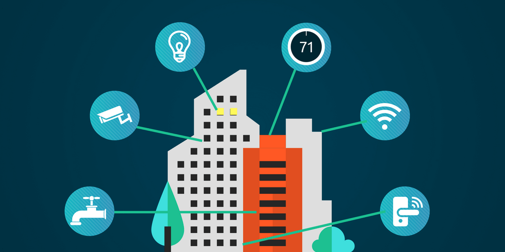

:::info [Help us track this Solution](contribute)
This a sample ChatGPT page to get the ball rolling.

[Click here to contribute content and feedback](contribute)
:::

        
List of companies working in this solution...

         <em>Note: this is an experimental feature. Accuracy not guaranteed</em>
        

            <ul>
             
                <li><a href="https://switchautomation.com">Switch Automation</a></li>
            
                <li><a href="https://softwaremotor.com">Software Motor Company</a></li>
            
            </ul>
        

        

:::company
  #### [View open jobs in this Solution](https://climatebase.org/jobs?l=&q=&drawdown_solutions=Building+Automation+Systems)
:::

## Overview

Significant progress has been achieved in developing Building Automation Systems to combat climate change. Breakthrough technologies targeting building efficiency have emerged:

1. **Building Envelope Technologies**: These enhance building thermal performance through improved sealing and insulation, reducing energy needed for heating and cooling and greenhouse gas emissions.

2. **Building Automation and Control Systems**: These automate functions like lighting, heating, and ventilation, reducing energy consumption and emissions.

3. **Renewable Energy Technologies**: These generate clean energy from sources like solar and wind, decreasing greenhouse gas emissions.

Noteworthy contributors include the U.S. Department of Energy, the International Energy Agency, and the Alliance to Save Energy.

## Progress Made

Significant headway in building efficiency has been achieved via Building Automation Systems. Innovations like advanced insulation, solar power systems, and energy-efficient windows have enhanced energy efficiency, reducing energy requirements for building climate control.

The U.S. Department of Energy, the National Renewable Energy Laboratory, and the Building Technologies Office have played vital roles in this progress.

## Lessons Learned

Key lessons from Building Automation Systems' development:
1. **Data Collection and Analysis Importance**: Accurate data collection and analysis are crucial for effective energy consumption management. They identify high consumption areas and aid in devising efficient energy reduction strategies.

2. **Integrated Approach Necessity**: A holistic approach is essential. Alongside Building Automation Systems, it includes retrofits, renewable energy generation, and operational and behavioral changes.

3. **Stakeholder Engagement**: Involvement of all stakeholders - building owners, occupants, and service providers - is vital. This comprehensive approach incorporates diverse needs and concerns.

4. **Ongoing Monitoring and Evaluation**: Continuous evaluation ensures sustained energy consumption reduction. Data drives necessary adjustments in systems, operations, and behavior.

## Challenges Ahead

The major challenges in Building Automation Systems' implementation remain:
1. **Lack of Awareness**: Wider awareness is needed about the technology's benefits among the public.
2. **Cost Constraints**: High installation and maintenance costs deter potential adopters, despite long-term benefits.
3. **Continual Development Requirement**: Ongoing technology improvement is necessary for greater efficiency and effectiveness.

## Best Path Forward

To effectively counter climate change, the following steps are crucial:
1. **Raising Awareness**: Educate the public about the technology's benefits.
2. **Cost Reduction**: Make the technology more affordable to encourage wider adoption.
3. **Enhanced Efficiency**: Continuously improve the technology for better results.
4. **Ease of Use**: Simplify installation and operation processes.

Leading companies like Nest, Philips, Johnson Controls, and Honeywell are pioneering these efforts:

1. Nest's programmable and remotely controlled thermostat saves energy.
2. Philips' energy-efficient LED lighting surpasses traditional lighting.
3. Johnson Controls' building management system optimizes energy use.
4. Honeywell's home automation system controls various home aspects, including climate control.

---

Image credit: [homebase.ai](https://homebase.ai/connected-buildings/the-benefits-of-building-automation/)
