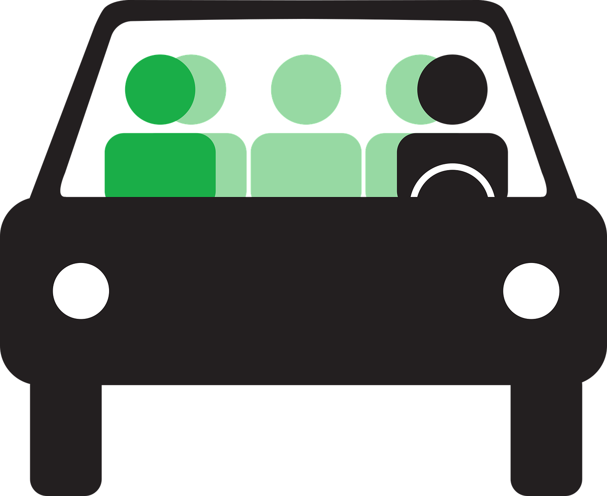

:::info [Help us track this Solution](contribute)

[Click here to contribute content and feedback](contribute)
:::

        
List of companies working in this solution...

         <em>Note: this is an experimental feature. Accuracy not guaranteed</em>
        

            <ul>
             
                <li><a href="https://www.xtelligent.io/">Xtligent</a></li>
            
                <li><a href="https://canoo.com">Canoo</a></li>
            
                <li><a href="https://www.ridecabin.com">Cabin</a></li>
            
            </ul>
        

        

:::company job openings
  #### [View open jobs in this Solution](https://climatebase.org/jobs?l=&q=&drawdown_solutions=Carpooling)
:::

## Overview
**Climate Technology Solution**: Carpooling

## Progress Made
- **Efficient Ride Sharing**: Carpooling has proven to be an easy and effective way to reduce individual car usage and emissions.
- **App-based Services**: Technologies like Uber, Lyft, and Waze have made carpooling more convenient and accessible.
- **HOV Lanes**: High-Occupancy Vehicle (HOV) lanes incentivize carpooling, reducing congestion and emissions.

## Challenges and Future Technologies
- **Future Technology Integration**: Potential for more advanced apps and platforms for optimized carpool matching.
- **Electric and Autonomous Vehicles**: Adoption of electric and self-driving cars could enhance carpooling efficiency.
- **Integration with Public Transit**: Seamless integration of carpooling with public transit systems.

## Best Path Forward
- **Continued Innovation**: Develop advanced technologies to make carpooling even more convenient.
- **Promotion and Awareness**: Increase public awareness about the benefits of carpooling.
- **Government Support**: Implement policies and incentives to encourage carpooling adoption.

