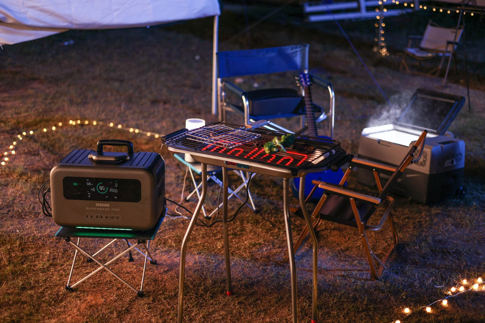

:::info [Help us track this Solution](contribute)
This a sample ChatGPT page to get the ball rolling.

[Click here to contribute content and feedback](contribute)
:::

:::info "the public debate about gas stoves has [received a lot of attention](https://www.npr.org/2023/01/13/1149135773/what-you-need-to-know-about-gas-stoves-and-health-risks) lately"
:::

        
List of companies working in this solution...

         <em>Note: this is an experimental feature. Accuracy not guaranteed</em>
        

            <ul>
             
                <li><a href="https://www.shiru.com/">Shiru</a></li>
            
                <li><a href="https://terramera.com">Terramera</a></li>
            
                <li><a href="https://terviva.com">Terviva</a></li>
            
                <li><a href="https://www.bellwethercoffee.com/">Bellwether Coffee</a></li>
            
                <li><a href="https://praktidesign.com">Prakti</a></li>
            
            </ul>
        

        

:::company
  #### [View open jobs in this Solution](https://climatebase.org/jobs?l=&q=&drawdown_solutions=Clean+Cooking)
:::

## Overview

* Clean cooking technologies, such as solar cookers and biomass cookstoves, are pivotal in reducing greenhouse gas emissions. 
* These technologies provide an eco-friendly alternative to traditional cooking methods.

## Progress Made

* **Key Technologies**: Solar cookers, improved stoves, and biogas digesters.
* **Applications**: These technologies find major usage in developing nations, aiding in cutting down reliance on wood and charcoal.
* **Prominent Contributors**: The Global Alliance for Clean Cookstoves, Sunfire, and EcoZoom are at the forefront.

## Lessons Learned

* **Affordability & Accessibility**: Technologies must be reasonably priced and available to the maximum number of users.
* **Usability & Maintenance**: The ease of using and upkeeping the technology is essential.
* **Training & Education**: Users need proper training on operation and maintenance.
* **Awareness Creation**: Highlighting the environmental and health benefits of clean cooking is crucial.
* **Successes & Failures**: While there have been achievements like emission reduction and indoor air quality improvement, challenges like improper use and inaccessibility persist.

## Challenges Ahead

* **Scaling Concerns**: The most significant hurdle is scaling up the adoption of these technologies.
* **Barriers to Adoption**: High costs, lack of awareness, limited access, and a dearth of trained professionals are major obstacles.

## Best Path Forward

* **Research & Development**: Focus on innovating cleaner and more efficient cooking methodologies.
* **Promote Clean Fuels**: Encourage the use of cleaner fuels like natural gas, propane, or electricity.
* **Increase Efficiency**: Design cookware and stoves that are fuel-efficient and emit fewer pollutants.
* **Raising Awareness**: Continuous advocacy and information dissemination are essential.
* **Facilitate Access**: Collaborate with governmental bodies and NGOs to provide financial incentives, making clean cooking technologies more accessible.
* **Leading Organizations**: The Clean Cookstoves Alliance, Global Alliance for Clean Cookstoves, and WHO have been instrumental in this movement.

- - -

Photo by <a href="https://unsplash.com/@zendure?utm_source=unsplash&utm_medium=referral&utm_content=creditCopyText">Zendure Power Station</a> on <a href="https://unsplash.com/photos/NKsbdVNdBV8?utm_source=unsplash&utm_medium=referral&utm_content=creditCopyText">Unsplash</a>