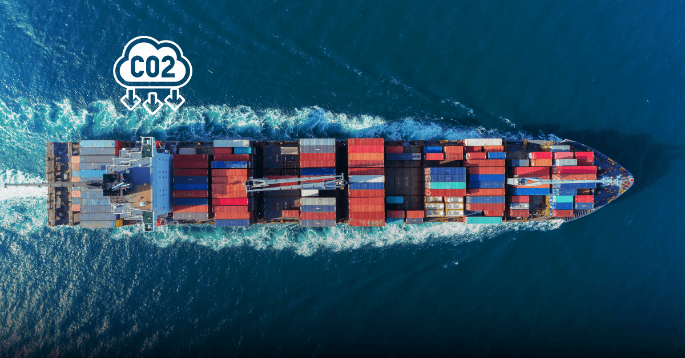

_Image Credit: [Marine Insight](https://www.marineinsight.com/maritime-law/energy-efficiency-design-index/)_

:::info [Help us track this Solution](contribute)
This a sample ChatGPT page to get the ball rolling.

[Click here to contribute content and feedback](contribute)
:::

        
List of companies working in this solution...

        

            <ul>
             
                <li><a href="https://convoy.com">Convoy</a></li>
            
                <li><a href="https://4ocean.com">4ocean</a></li>
            
                <li><a href="https://nan">Boundary Layer</a></li>
            
                <li><a href="https://nautiluslabs.co">Nautilus Labs</a></li>
            
            </ul>
        

        

## Overview

- **Breakthrough Technologies**: Efficient ship engines, wind power for propulsion.
- **Reducing Greenhouse Gas Emissions**: Focus on making ocean shipping more efficient.
- **Key Players**: International Maritime Organization, Clean Shipping Alliance.

## Progress Made

- **Technological Advances**: Efficient engines, fuel-efficient vessels, better hull designs.
- **Companies at Forefront**: Maersk, CMA CGM, International Maritime Organization.

## Lessons Learned

1. **Emission Reduction Potential**: Efficient ocean shipping can cut maritime sector emissions by up to 30%.
2. **Technology Refinement**: Continued development needed for full potential.
3. **Successes and Failures**: Mixed results, need for refinement.
4. **Past Mistakes**: Insufficient R&D investment, incomplete life cycle consideration.
5. **Continued Success**: Investment in engines, alternative fuels, efficient practices.

## Challenges Ahead

- **Technology Development**: Further refinement and efficiency improvement required.
- **Cost Prohibitive**: High cost hinders scalability and adoption.
- **Awareness Deficit**: Lack of understanding about benefits hampers investment.
- **Key Organizations**: International Maritime Organization (IMO), United Nations Framework Convention on Climate Change (UNFCCC), International Renewable Energy Agency (IRENA).
- **Stakeholder Involvement**: Collaborative development involving technology developers, policy makers, and end users.

## Best Path Forward

1. **Research and Development**: Continued investment to improve technology.
2. **Awareness Increase**: Education and marketing campaigns about benefits.
3. **Incentives**: Financial support through tax breaks, subsidies, etc.
4. **Mandates**: Regulations to enforce technology adoption.

## Key Players**

- **Companies**: Maersk, CMA CGM.
- **Organizations**: International Maritime Organization.
- **Progress**: Advances made, ongoing efforts needed.

