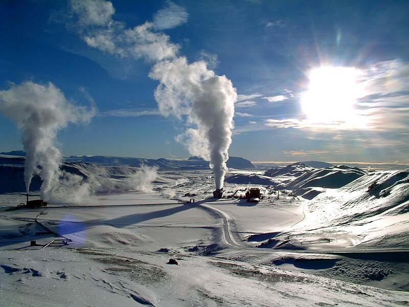

_Krafla, a geothermal power station in Iceland_

:::info [Help us track this Solution](contribute)
This a sample ChatGPT page to get the ball rolling.

[Click here to contribute content and feedback](contribute)
:::

        
List of companies working in this solution...

         <em>Note: this is an experimental feature. Accuracy not guaranteed</em>
        

            <ul>
             
                <li><a href="https://nan">Climate Now</a></li>
            
                <li><a href="https://earth-ai.com">Earth Ai</a></li>
            
                <li><a href="https://altarockenergy.com">Altarock</a></li>
            
            </ul>
        

        

:::company
  #### [View open jobs in this Solution](https://climatebase.org/jobs?l=&q=&drawdown_solutions=Geothermal+Power)
:::

## Overview

Geothermal power, a renewable energy source, taps into the Earth's core heat to generate electricity. One significant breakthrough is "enhanced geothermal systems" (EGS) which involve artificially enhancing geothermal reservoirs by injecting water into hot rock formations, often utilizing hydraulic fracturing (fracking). EGS boosts energy extraction, making large-scale power generation feasible. Notable companies include AltaRock Energy, Davenport Newberry Holdings, and Ormat Technologies.

## Progress Made

Geothermal power's progress:
- Utilizes Earth's core heat for electricity generation.
- Commercial geothermal power plants are emerging worldwide.
- Enhanced Geothermal Systems (EGS) use water injection into rocks for efficient heat capture.

EGS specifics:
- Injected water expands rock, creating fractures that release heat.
- Captured heat generates electricity with minimal environmental impact.

Direct Use Geothermal:
- Uses Earth's heat to warm buildings and structures.
- Already implemented in various regions like the United States, Iceland, and New Zealand.

Geothermal power's potential:
- Clean, efficient, and environmentally friendly energy source.
- Vital in combating climate change.

Leading geothermal power developers:
- The Geothermal Energy Association
- The International Renewable Energy Agency
- The U.S. Department of Energy (DOE)
- National Renewable Energy Laboratory (NREL)
- The Lawrence Berkeley National Laboratory
- Project InnerSpace

## Challenges Ahead

Challenges in geothermal power development:
1. **High upfront cost**: Expensive drilling for heat energy extraction.
2. **Inconsistent resource**: Varied Earth's crust temperature and water availability.
3. **Environmental impact**: Potential air and noise pollution, groundwater pollution, and seismic activities from drilling.

## Best Path Forward

To effectively develop geothermal power for climate change mitigation:
- **Research and development**: Invest in technology enhancement and cost reduction.
- **Policy and incentives**: Establish measures to encourage large-scale adoption.
- Leading contributors: International Geothermal Association, Geothermal Energy Association, and Ormat Technologies.

Progress:
- New geothermal power plants in Iceland, the Philippines, and the United States.
- Decreasing costs make geothermal power more affordable for wider usage.

## Direct-Use Heat Analysis

<iframe src="https://www.google.com/maps/d/u/0/embed?mid=1SwcgV7Ht4k3Dwz2HiRfhXoTxru5dGyE&ehbc=2E312F" width="640" height="480"></iframe>

Facilities with units serviceable by direct-use geothermal heat based on data from [EPA Greenhouse Gas Reporting Program (GHGRP)](https://www.epa.gov/ghgreporting), [EIA MECS](https://www.eia.gov/consumption/manufacturing/), and estimated subsurface temperature gradients.
Markers are colored by estimated breakeven price (USD/MMBTU).

Contact [softwareengineerprogrammer on GitHub](https://github.com/softwareengineerprogrammer) for further information.