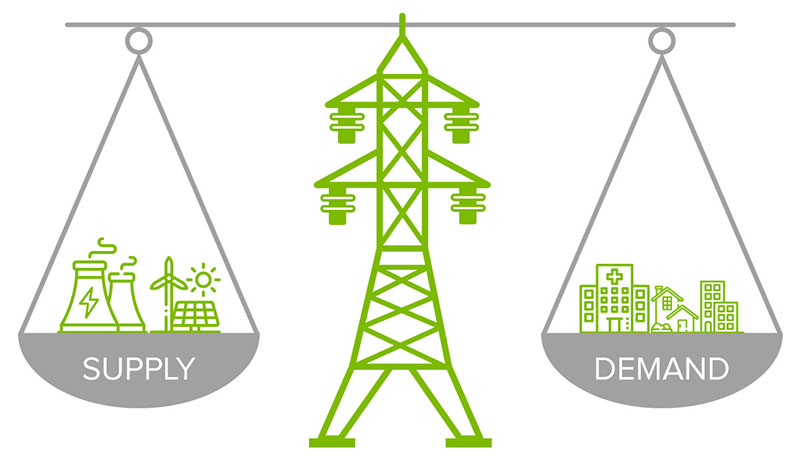

_Image from the [Alliance for an Energy Efficient Economy](https://aeee.in/why-indian-grid-operators-need-to-acknowledge-demand-flexibility-for-optimal-grid-operation/) in India_

:::info [Help us track this Solution](contribute)
This a sample ChatGPT page to get the ball rolling.

[Click here to contribute content and feedback](contribute)
:::

## Overview

Grid flexibility refers to the capability of the electric grid to accommodate diverse energy sources and dynamically adapt to changing demand and supply conditions, enhancing efficiency and resilience.

Breakthroughs in the development of grid-scale battery storage has facilitated the storage and utilization of excess renewable energy, thereby minimizing waste and propelling the growth of renewable energy sources. 

Additional innovations include advanced algorithms for grid management and adaptable demand-side management techniques, fostering grid flexibility and reducing fossil fuel dependence.

Pioneering entities in these advancements encompass Tesla, AES, and Green Charge Networks.

## Progress Made

1. **Smart meters:** These devices gauge and regulate electricity usage in real-time, providing data to optimize the grid and curtail waste.

2. **Battery storage:** Enabling surplus renewable energy storage and subsequent dispatch when needed, mitigating the variability of renewable energy sources.

3. **Demand response:** This technology enables real-time electricity demand management, curbing peak demand and lessening reliance on polluting power plants.

Key contributors in the progress of these technologies are Green Mountain Power, a leader in smart meter deployment, Tesla, a prominent battery storage manufacturer, and EnerNOC, a provider of demand response services. Their efforts are instrumental in enhancing grid efficiency and reducing greenhouse gas emissions.

## Lessons Learned

Essential lessons derived from grid flexibility implementation for climate change reversal encompass:

1. **Strategic Planning:** A clear and concise plan is crucial, outlining goals and available resources.

2. **Diverse Approaches:** Grid flexibility can be achieved through energy storage, demand response, and load management.

3. **Emission Reduction:** Effective grid flexibility implementation can substantially reduce carbon emissions.

4. **Challenges Abound:** Challenges such as high upfront costs, standardization gaps, and technical intricacies need addressing.

Despite obstacles, grid flexibility remains a vital solution for climate change. Collaborative efforts by entities like Tesla, Green Mountain Power, and the Electric Power Research Institute are pivotal in advancing and implementing grid flexibility solutions.

## Challenges Ahead

Predominant challenges confronting the development and implementation of Grid Flexibility include:

1. **Technical Hurdles:**

   - Adapting grid flexibility to existing grid infrastructure necessitates costly and time-consuming upgrades.
   - Ongoing technical complexities demand resolution before widespread adoption.

2. **Economic Obstacles:**

   - Lack of an existing market for grid flexibility hampers investment and scalability.
   - Higher costs relative to existing technologies could hinder market competitiveness.

3. **Social Barriers:**

   - Limited public awareness of grid flexibility and its advantages poses implementation resistance.
   - Insufficient government backing might impede widespread adoption.

## Best Path Forward

To effectively mitigate climate change effects, the ideal path forward for Grid Flexibility involves:

1. **Gradual Scaling:** Thorough testing on a smaller scale before larger-scale implementation ensures effectiveness and problem mitigation.
   
2. **Public Education:** Ongoing public awareness campaigns highlighting technology benefits and climate change mitigation aspects.

3. **Collaboration:** Continued engagement with governments and utility companies for widespread adoption.

Collective efforts in technology development, public engagement, and strategic collaboration will propel the realization of grid flexibility's potential in climate change mitigation.