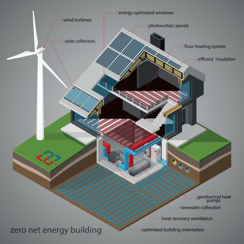

:::info [Help us track this Solution](contribute)
This a sample ChatGPT page to get the ball rolling.

[Click here to contribute content and feedback](contribute)
:::

        
List of companies working in this solution...

         <em>Note: this is an experimental feature. Accuracy not guaranteed</em>
        

            <ul>
             
                <li><a href="https://cleanchoiceenergy.com">Cleanchoice Energy</a></li>
            
                <li><a href="https://bettervest.com/home?r=56fe666…">Bettervest</a></li>
            
                <li><a href="https://bulb.co.uk">Bulb</a></li>
            
                <li><a href="https://www.evolvemyenergy.com/">Evolve Energy</a></li>
            
                <li><a href="https://www.blueprintpower.com/">Blue Print Power</a></li>
            
            </ul>
        

        

:::company
  #### [View open jobs in this Solution](https://climatebase.org/jobs?l=&q=&drawdown_solutions=Net+Zero+Buildings)
:::

## Overview

The development of Net Zero Buildings is a significant advancement in the fight against climate change, encompassing breakthrough technologies like solar panels, wind turbines, and geothermal systems that drastically reduce greenhouse gas emissions. Leading entities driving this progress include the International Living Future Institute, U.S. Green Building Council, and Architecture 2030.

## Progress Made

In the realm of Net Zero Buildings, remarkable headway has been achieved through innovative technologies:

- **Solar panels**: Enhanced efficiency in converting sunlight into electricity has led to reduced energy consumption and subsequently lowered greenhouse gas emissions.
- **Wind turbines**: Advanced wind turbine technology has heightened the conversion of wind energy into electricity, resulting in decreased energy requirements and lower greenhouse gas emissions.
- **Geothermal systems**: Leveraging Earth's heat for energy generation has gained traction, offering a cleaner energy source and curbing greenhouse gas emissions.
- **Energy-efficient appliances**: Appliances designed with lower energy consumption contribute to diminished energy use and reduced greenhouse gas emissions.
- **Insulation**: Improved insulation conserves energy for heating and cooling, translating to lowered energy consumption and greenhouse gas emissions.
- **LED lighting**: More energy-efficient LED lighting has led to decreased energy consumption and consequently, reduced greenhouse gas emissions.
- **Electric vehicles**: Electric vehicles powered by electricity significantly reduce transportation-related greenhouse gas emissions.
- **Public transportation**: Electricity or renewable fuels powered public transportation options contribute to curbing emissions from transportation.
- **Ride-sharing**: Ride-sharing services lower transportation emissions by facilitating shared rides.
- **Telecommuting**: Advances in technology enabling telecommuting lead to reduced emissions from transportation.

Companies and organizations propelling Net Zero Buildings include the International Living Future Institute, U.S. Department of Energy, U.S. Green Building Council, Green Building Initiative, and LEED certification program.

## Lessons Learned

Several pivotal lessons have emerged from the development of Net Zero Buildings:

1. **Energy Efficiency Importance**: Energy-efficient practices are critical, given that buildings account for approximately 40% of global energy usage, making increased efficiency vital to combating climate change.
2. **Renewable Energy Synergy**: Combining renewable energy sources, like solar and wind power, with energy-efficient measures significantly reduces carbon emissions associated with buildings.
3. **Community Involvement**: Engaging communities is crucial for successful Net Zero Buildings, ensuring buildings meet community needs and garner support.
4. **Continuous Journey**: The development and implementation of Net Zero Buildings is an ongoing process, demanding persistence through setbacks and challenges to reverse climate change.

## Challenges Ahead

Key challenges in advancing Net Zero Buildings encompass scalability and financing:

1. **Technical Challenges**:
   - Adapting existing grid infrastructure for grid flexibility poses a challenge, requiring substantial upgrades.
   - Ongoing technical complexities must be addressed before widespread adoption.

2. **Economic Challenges**:
   - Developing a market for a nascent technology like grid flexibility necessitates financial investment.
   - Elevated costs compared to conventional technologies may hinder widespread market adoption.

3. **Social Challenges**:
   - Limited public awareness and government support for grid flexibility may impede its large-scale implementation.

## Best Path Forward

To advance Net Zero Buildings and combat climate change:

1. Increasing awareness of net zero building benefits.
2. Encouraging government policies incentivizing net zero building construction.
3. Investing in research and development to enhance the technology.
4. Collaborating with the building industry to establish net zero building standards.

Key players in this effort include the International Living Future Institute, U.S. Department of Energy, and the New Buildings Institute.